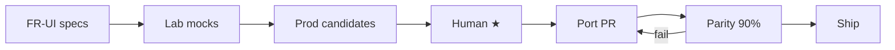

# Closed Sandbox — UI pipeline (Design Studio → Production)

> **Статус:** CS-P03 **ported** (2026-08-02) · NL-ADR-018 · host = neurolab `sandbox/ui/`  
> **UI канон:** [`CLOSED-SANDBOX-UI.md`](CLOSED-SANDBOX-UI.md)  
> **Функции:** [`CLOSED-SANDBOX-UI-REQS.md`](CLOSED-SANDBOX-UI-REQS.md)  
> **Конвейер Outpost (эталон):** Commercial `docs/DESIGN-TO-PROD.md` · `./scripts/design-studio.sh`  
> **Правило:** Commercial `.cursor/rules/08-design-mockups.mdc`

---

## 1. Принцип

Сначала **просчитать и разложить в Design Studio**, потом код.

```text
FR (требования)  →  Lab mockups  →  ★ Approve  →  Prod mockups
                         ↓                            ↓
                    итерации дизайна            Port + parity ≥90%
                                                      ↓
                                                 Production UI
```

**Без ★ human — агент не переносит в prod** (только макеты / Lab).

Closed Sandbox UI живёт в том же Design Studio, что Outpost (Commercial `design/`), отдельной **категорией / разделом** — не смешивать с Outpost Prod Port без явного hub.

---

## 2. Раздел в Design Studio

### 2.1 Куда

| Место | Репо | Путь |
|---|---|---|
| Design Studio | `AI-Platform-Vision` | `design/studio/` + `manifest.json` |
| Макеты Sandbox | Commercial | `design/sandbox/` (new) |
| Parity чеклисты | Commercial | `design/sandbox/parity/*.yaml` |
| Engine / CLI SoT | **neurolab** | `sandbox/` (уже есть) |
| Production UI (позже) | Commercial или neurolab static | решить на ★ Port (см. §6) |

Запуск студии (как сейчас у Outpost):

```bash
cd ~/Projects/AI-Platform-Vision
./scripts/design-studio.sh
# → http://127.0.0.1:9394/design/studio/
```

### 2.2 Структура раздела (категория `closed-sandbox`)

В `manifest.json` — **одна категория**, внутри два явных блока:

```text
Closed Sandbox
├── Hub                          # оглавление + ссылки на FR
├── ── Prod mockups ★ ──         # только утверждённые / кандидаты Port
│     ├── CS-P01 Overview
│     ├── CS-P02 Editor
│     ├── CS-P03 Run + Results
│     ├── CS-P04 Diff
│     └── CS-P05 Ask (contour)
└── ── Lab / Dev mockups ──      # черновики, эксперименты, не Port
      ├── CS-L01 …
      ├── CS-L02 …
      └── …
```

| Тип | Studio badge | Можно Port? | Кто трогает |
|---|---|---|---|
| **Prod mockups** | `★` / `Port candidate` | да, после human ★ | дизайн → eng |
| **Lab / Dev mockups** | `Lab` / `Dev` | **нет** | дизайн / R&D |

Правило как у Outpost: **Lab ≠ Prod hub**. Агент не берёт Lab-макет в Port.

### 2.3 Обязательные поля каждого макета (карточка Studio)

| Поле | Зачем |
|---|---|
| `id` | стабильный (`CS-P03`) |
| `title` | человекочитаемо |
| `path` | HTML в `design/sandbox/` |
| `fr_ids[]` | связь с требованиями (`FR-UI-…`) |
| `status` | `lab` \| `candidate` \| `starred` \| `ported` |
| `parity` | путь к yaml (для candidate+) |
| `cli_parity` | команда CLI, которую UI дублирует |

Без `fr_ids` макет **не** поднимается в Prod-секцию.

---

## 3. Связь с функциональными требованиями

Каждый экран = набор **FR-UI-*** из [`CLOSED-SANDBOX-UI-REQS.md`](CLOSED-SANDBOX-UI-REQS.md).

```text
FR-UI-010 Run project
    ↓ covers
CS-P03 Run + Results  (mock)
    ↓ ports to
Production: Run view + same metrics as CLI
```

В макете (HTML comment или meta-блок):

```html
<!--
  id: CS-P03
  fr: FR-UI-010, FR-UI-011, FR-UI-012
  cli: closed-sandbox run <project>
  status: lab
-->
```

В Studio Hub — таблица **FR → mock → status** (генерировать вручную на старте, потом можно скриптом).

---

## 4. Конвейер Design → Production (Closed Sandbox)

Адаптация Commercial `DESIGN-TO-PROD.md` под sandbox:

| Шаг | Действие | Gate |
|---|---|---|
| **0. Spec** | FR в `CLOSED-SANDBOX-UI-REQS.md` + IA в UI-каноне | FR id существуют |
| **1. Lab mock** | HTML в `design/sandbox/`, пункт Studio **Lab** | `fr_ids` заполнены |
| **2. Review** | human смотрит в Design Studio vs UI-канон | правки в Lab |
| **3. Promote** | перенос карточки в **Prod mockups**, `status=candidate` | human |
| **4. ★ Approve** | human ★; создать `parity/CS-Pxx.yaml` | **без ★ — stop** |
| **5. Port** | реализация UI (один vertical = один PR) | CLI parity обязательна |
| **6. Parity gate** | side-by-side Studio ↔ running UI; yaml `done`/`waived` | ≥90% |
| **7. Ship** | STATUS + VERIFY; CLI e2e + UI smoke | |



### CLI = контракт поведения

Любой Prod-экран обязан иметь CLI-эквивалент:

| UI | CLI |
|---|---|
| Run | `closed-sandbox run` |
| Results | `out/metrics.json` + `report.md` |
| Diff | `closed-sandbox diff` |
| Ask | `closed-sandbox ask` |

Нет CLI → нет Port (сначала engine).

---

## 5. Что сделать в Commercial (чеклист внедрения раздела)

**Сделано (2026-07-29):** раздел в Design Studio заведён.

- [x] Создать `design/sandbox/` + `parity/`
- [x] Категория `closed-sandbox` в `design/studio/manifest.json`
- [x] Hub page `design/studio/pages/closed-sandbox-hub.html` (FR table + Prod/Lab split)
- [x] Placeholder Lab mocks CS-L01…05 для IA из UI-канона §3
- [x] Ссылка из `design/README.md` → Closed Sandbox hub
- [x] Не класть в `#outpost-prod-hub` без отдельного решения

Neurolab держит **спеки и каноны**; Commercial — **макеты и Port**.

---

## 6. Куда пойдёт Production UI (решение на Port)

| Вариант | Плюс | Минус |
|---|---|---|
| A. Neurolab `sandbox/ui/` local web | рядом с engine | отдельный host |
| B. Commercial `/ui/` section «Sandbox» | один Design→Prod конвейер | смешение продуктов |
| C. Embed panel в Outpost | единый contour | тяжелее scope |

**CS-P03 Port (2026-08-02):** **A** chosen — see **NL-ADR-018**. B/C deferred.  
**CS-P04 Port (2026-08-04):** same host · `/diff` · FR-UI-020.  
**CS-P05 Port (2026-08-04):** same host · `/ask` · FR-UI-030/031.  
**CS-P01 / CS-P02 Port (2026-08-05):** `/` Overview · `/editor` Manifest · FR-UI-001/002.

---

## 7. Порядок работ (сейчас)

1. ✅ Зафиксировать этот pipeline + FR (`CLOSED-SANDBOX-UI-REQS.md`)  
2. ✅ Завести раздел в Design Studio (Commercial) — hub + Lab placeholders  
3. ✅ Наполнить Lab mocks по FR (CS-L01…05)  
4. ✅ Human ★ CS-P03 (Run+Results) + `parity/CS-P03.yaml`  
5. ✅ Port UI CS-P03 — `closed-sandbox ui` · neurolab `sandbox/ui/`  

**Запрет агентам:** «сразу React/HTML prod UI без макета в Studio и без FR»; Lab `CS-L*` ≠ Port.

---

## 8. Definition of Done (дизайн-фаза, до кода UI)

- [x] Категория Closed Sandbox видна в Design Studio  
- [x] Есть Hub с таблицей FR → mock  
- [x] Prod и Lab секции визуально разделены  
- [x] ≥1 Lab mock на каждый primary view (Overview, Editor, Run/Results, Diff, Ask)  
- [x] Каждый mock с `fr_ids` + `cli_parity`  
- [x] Human ★ на первый Port-кандидат (CS-P03 · 2026-08-02)  
- [x] Parity yaml создан (`design/sandbox/parity/CS-P03.yaml`, items pending)  
